# Stratigos AI Platform - Serverless Architecture Plan

## 1. Overview

This document outlines the architecture and implementation plan for the Stratigos AI Platform using a pure serverless approach with AWS Lambda and API Gateway, without relying on FastAPI or other heavy frameworks.

## 2. Architecture

### 2.1 Core Components

## Updated End-to-End Architecture

```mermaid
graph TB
    subgraph "Client Layer"
        WebApp[Web Application]
        MobileApp[Mobile App]
        APIClient[API Clients]
    end
    
    subgraph "AWS Cloud"
        subgraph "API Gateway Layer"
            APIGW[API Gateway]
            Auth[API Key Authentication]
            Throttle[Rate Limiting & Throttling]
            Cache[Response Caching]
        end
        
        subgraph "Lambda Functions Layer"
            subgraph "Portfolio Functions"
                CreatePortfolio[Create Portfolio]
                GetPortfolio[Get Portfolio]
                ListPortfolios[List Portfolios]
                UpdatePortfolio[Update Portfolio]
                DeletePortfolio[Delete Portfolio]
            end
            
            subgraph "Optimization Functions"
                RiskParity[Risk Parity Optimization]
                HRP[Hierarchical Risk Parity]
                EfficientFrontier[Efficient Frontier]
            end
            
            subgraph "Analytics Functions"
                MonteCarloSim[Monte Carlo Simulation]
                SimAnalysis[Simulation Analysis]
            end
            
            subgraph "Market Data Functions"
                GetPrices[Get Market Prices]
                GetReturns[Get Market Returns]
            end
        end
        
        subgraph "Lambda Layers"
            CoreLayer[Core Dependencies Layer<br/>boto3, pydantic, requests]
            NumericLayer[Numeric Computing Layer<br/>numpy, pandas, scipy]
            PlottingLayer[Visualization Layer<br/>matplotlib, seaborn]
            UtilsLayer[Utilities Layer<br/>dateutil, uuid]
        end
        
        subgraph "Data Storage Layer"
            subgraph "DynamoDB Tables"
                PortfolioTbl[(Portfolios Table)]
                OptResultTbl[(Optimization Results)]
                SimResultTbl[(Simulation Results)]
            end
            
            subgraph "S3 Storage"
                DataBucket[(Data Bucket<br/>Market Data, Reports)]
                LayerBucket[(Layer Bucket<br/>Lambda Layers)]
            end
        end
        
        subgraph "Monitoring & Security"
            CloudWatch[CloudWatch Logs & Metrics]
            XRay[X-Ray Tracing]
            IAM[IAM Roles & Policies]
        end
    end
    
    %% Connections
    WebApp --> APIGW
    MobileApp --> APIGW
    APIClient --> APIGW
    
    APIGW --> Auth
    Auth --> Throttle
    Throttle --> Cache
    
    Cache --> CreatePortfolio
    Cache --> GetPortfolio
    Cache --> ListPortfolios
    Cache --> UpdatePortfolio
    Cache --> DeletePortfolio
    Cache --> RiskParity
    Cache --> HRP
    Cache --> EfficientFrontier
    Cache --> MonteCarloSim
    Cache --> SimAnalysis
    Cache --> GetPrices
    Cache --> GetReturns
    
    %% Lambda Layers connections
    CoreLayer -.-> CreatePortfolio
    CoreLayer -.-> GetPortfolio
    CoreLayer -.-> ListPortfolios
    CoreLayer -.-> UpdatePortfolio
    CoreLayer -.-> DeletePortfolio
    CoreLayer -.-> GetPrices
    CoreLayer -.-> GetReturns
    
    NumericLayer -.-> RiskParity
    NumericLayer -.-> HRP
    NumericLayer -.-> EfficientFrontier
    NumericLayer -.-> MonteCarloSim
    NumericLayer -.-> SimAnalysis
    
    PlottingLayer -.-> EfficientFrontier
    PlottingLayer -.-> SimAnalysis
    
    %% Data connections
    CreatePortfolio --> PortfolioTbl
    GetPortfolio --> PortfolioTbl
    ListPortfolios --> PortfolioTbl
    UpdatePortfolio --> PortfolioTbl
    DeletePortfolio --> PortfolioTbl
    
    RiskParity --> OptResultTbl
    HRP --> OptResultTbl
    EfficientFrontier --> OptResultTbl
    
    MonteCarloSim --> SimResultTbl
    SimAnalysis --> SimResultTbl
    
    GetPrices --> DataBucket
    GetReturns --> DataBucket
    EfficientFrontier --> DataBucket
    MonteCarloSim --> DataBucket
    
    %% Layer storage
    CoreLayer --> LayerBucket
    NumericLayer --> LayerBucket
    PlottingLayer --> LayerBucket
    
    %% Monitoring
    CreatePortfolio --> CloudWatch
    RiskParity --> CloudWatch
    MonteCarloSim --> CloudWatch
    
    CreatePortfolio --> XRay
    RiskParity --> XRay
    MonteCarloSim --> XRay
```



1. **AWS Lambda Functions**
   - Core request handlers
   - Business logic modules
   - Utility functions

2. **Amazon API Gateway**
   - REST API endpoints
   - Request/response mapping
   - Authentication and authorization
   - Rate limiting and throttling

3. **Amazon DynamoDB**
   - Portfolio data storage
   - User preferences
   - Optimization results

4. **Amazon S3**
   - Static assets
   - Large dataset storage
   - Optimization result exports

5. **AWS CloudFormation/SAM**
   - Infrastructure as code
   - Deployment automation
   - Environment management

6. **AWS CloudWatch**
   - Logging
   - Monitoring
   - Alerting

### 2.2 Data Flow

1. Client sends request to API Gateway
2. API Gateway routes request to appropriate Lambda function
3. Lambda function processes request:
   - Validates input
   - Performs business logic
   - Interacts with DynamoDB/S3 as needed
   - Returns response
4. API Gateway returns response to client

## 3. Project Structure

```
stratigos-ai-platform-serverless/
├── README.md
├── template.yaml                  # SAM/CloudFormation template
├── requirements.txt               # Python dependencies
├── src/
│   ├── functions/                 # Lambda function handlers
│   │   ├── portfolios/
│   │   │   ├── __init__.py        # Package initialization
│   │   │   ├── create.py          # Create portfolio handler
│   │   │   ├── get.py             # Get portfolio handler
│   │   │   ├── list.py            # List portfolios handler
│   │   │   ├── update.py          # Update portfolio handler
│   │   │   └── delete.py          # Delete portfolio handler
│   │   ├── optimization/
│   │   │   ├── __init__.py        # Package initialization
│   │   │   ├── risk_parity.py     # Risk parity optimization handler
│   │   │   ├── hrp.py             # HRP optimization handler
│   │   │   └── efficient_frontier.py # Efficient frontier handler
│   │   ├── monte_carlo/
│   │   │   ├── __init__.py        # Package initialization
│   │   │   ├── simulate.py        # Monte Carlo simulation handler
│   │   │   └── analyze.py         # Simulation analysis handler
│   │   └── market_data/
│   │       ├── __init__.py        # Package initialization
│   │       ├── get_prices.py      # Get market prices handler
│   │       └── get_returns.py     # Get market returns handler
│   ├── lib/                       # Shared library code
│   │   ├── __init__.py            # Package initialization
│   │   ├── models/                # Data models
│   │   │   ├── __init__.py        # Package initialization
│   │   │   ├── portfolio.py       # Portfolio model
│   │   │   └── optimization.py    # Optimization model
│   │   ├── services/              # Business logic services
│   │   │   ├── __init__.py        # Package initialization
│   │   │   ├── portfolio_service.py  # Portfolio service
│   │   │   ├── optimization_service.py # Optimization service
│   │   │   └── market_service.py  # Market data service
│   │   ├── utils/                 # Utility functions
│   │   │   ├── __init__.py        # Package initialization
│   │   │   ├── validation.py      # Input validation
│   │   │   ├── response.py        # Response formatting
│   │   │   └── error_handler.py   # Error handling
│   │   └── db/                    # Database access
│   │       ├── __init__.py        # Package initialization
│   │       ├── dynamo_client.py   # DynamoDB client
│   │       └── s3_client.py       # S3 client
│   └── config/                    # Configuration
│       ├── __init__.py            # Package initialization
│       ├── constants.py           # Constants
│       └── settings.py            # Settings
├── tests/                         # Tests
│   ├── __init__.py                # Package initialization
│   ├── unit/                      # Unit tests
│   │   ├── __init__.py            # Package initialization
│   │   ├── functions/             # Function tests
│   │   ├── lib/                   # Library tests
│   │   └── utils/                 # Utility tests
│   └── integration/               # Integration tests
│       └── __init__.py            # Package initialization
├── scripts/                       # Utility scripts
│   ├── deploy.sh                  # Deployment script
│   ├── test.sh                    # Test script
│   └── local.sh                   # Local development script
└── docs/                          # Documentation
    ├── API.md                     # API documentation
    ├── DEPLOYMENT.md              # Deployment documentation
    └── DEVELOPMENT.md             # Development documentation
```

## 4. API Design

### 4.1 Endpoints

#### Portfolios

| Method | Endpoint | Description |
|--------|----------|-------------|
| GET    | /portfolios | List all portfolios |
| GET    | /portfolios/{id} | Get portfolio by ID |
| POST   | /portfolios | Create a new portfolio |
| PUT    | /portfolios/{id} | Update a portfolio |
| DELETE | /portfolios/{id} | Delete a portfolio |

#### Optimization

| Method | Endpoint | Description |
|--------|----------|-------------|
| POST   | /optimization/risk-parity | Run risk parity optimization |
| POST   | /optimization/hrp | Run hierarchical risk parity optimization |
| POST   | /optimization/efficient-frontier | Generate efficient frontier |

#### Monte Carlo

| Method | Endpoint | Description |
|--------|----------|-------------|
| POST   | /monte-carlo/simulate | Run Monte Carlo simulation |
| POST   | /monte-carlo/analyze | Analyze simulation results |

#### Market Data

| Method | Endpoint | Description |
|--------|----------|-------------|
| GET    | /market-data/prices | Get market prices |
| GET    | /market-data/returns | Get market returns |

### 4.2 Request/Response Format

All API requests and responses will use JSON format.

#### Example Request

```json
{
  "portfolio": {
    "name": "Tech Concentrated",
    "description": "Technology-focused portfolio with high concentration",
    "assets": {
      "AAPL": 0.25,
      "MSFT": 0.25,
      "GOOGL": 0.20,
      "AMZN": 0.20,
      "META": 0.10
    }
  }
}
```

#### Example Response

```json
{
  "id": "p-123456",
  "portfolio": {
    "name": "Tech Concentrated",
    "description": "Technology-focused portfolio with high concentration",
    "assets": {
      "AAPL": 0.25,
      "MSFT": 0.25,
      "GOOGL": 0.20,
      "AMZN": 0.20,
      "META": 0.10
    }
  },
  "createdAt": "2025-06-28T12:34:56Z",
  "updatedAt": "2025-06-28T12:34:56Z"
}
```

### 4.3 Error Handling

All errors will return a standard error response format:

```json
{
  "error": {
    "code": "VALIDATION_ERROR",
    "message": "Invalid portfolio format",
    "details": [
      "Asset weights must sum to 1.0"
    ]
  }
}
```

## 5. Data Model

### 5.1 Portfolio

```json
{
  "id": "string",
  "name": "string",
  "description": "string",
  "assets": {
    "string": "number"
  },
  "createdAt": "string",
  "updatedAt": "string"
}
```

### 5.2 Optimization Result

```json
{
  "id": "string",
  "portfolioId": "string",
  "type": "string",
  "parameters": {
    "key": "value"
  },
  "result": {
    "weights": {
      "string": "number"
    },
    "metrics": {
      "key": "value"
    }
  },
  "createdAt": "string"
}
```

### 5.3 Simulation Result

```json
{
  "id": "string",
  "portfolioId": "string",
  "parameters": {
    "key": "value"
  },
  "result": {
    "trajectories": [
      [
        "number"
      ]
    ],
    "statistics": {
      "key": "value"
    }
  },
  "createdAt": "string"
}
```

## 6. Implementation Plan

### 6.1 Phase 1: Core Infrastructure

1. Set up project structure
2. Create CloudFormation/SAM template
3. Implement basic Lambda function handlers
4. Configure API Gateway
5. Set up DynamoDB tables
6. Implement CI/CD pipeline

### 6.2 Phase 2: Portfolio Management

1. Implement portfolio model
2. Implement portfolio service
3. Implement portfolio API endpoints
4. Write tests for portfolio functionality
5. Document portfolio API

### 6.3 Phase 3: Optimization

1. Implement optimization models
2. Implement optimization services
3. Implement optimization API endpoints
4. Write tests for optimization functionality
5. Document optimization API

### 6.4 Phase 4: Monte Carlo Simulation

1. Implement simulation models
2. Implement simulation services
3. Implement simulation API endpoints
4. Write tests for simulation functionality
5. Document simulation API

### 6.5 Phase 5: Market Data

1. Implement market data services
2. Implement market data API endpoints
3. Write tests for market data functionality
4. Document market data API

### 6.6 Phase 6: Integration and Testing

1. Integrate all components
2. Write integration tests
3. Perform load testing
4. Fix bugs and optimize performance

### 6.7 Phase 7: Documentation and Deployment

1. Finalize API documentation
2. Write deployment documentation
3. Write development documentation
4. Deploy to production

## 7. Development Workflow

### 7.1 Local Development

1. Clone repository
2. Install dependencies
3. Run local development server
4. Test API endpoints locally
5. Run unit tests

### 7.2 Deployment

1. Push changes to repository
2. CI/CD pipeline runs tests
3. If tests pass, deploy to staging
4. Test in staging environment
5. If tests pass, deploy to production

### 7.3 Testing

1. Write unit tests for all functions
2. Write integration tests for API endpoints
3. Run tests locally before committing
4. CI/CD pipeline runs tests automatically

## 8. Technology Stack

### 8.1 Backend

- **Runtime**: Python 3.11
- **Framework**: AWS Lambda, API Gateway
- **Database**: Amazon DynamoDB
- **Storage**: Amazon S3
- **Infrastructure**: AWS CloudFormation/SAM

### 8.2 Development Tools

- **Version Control**: Git
- **CI/CD**: GitHub Actions
- **Testing**: pytest, unittest
- **Documentation**: Markdown, Sphinx
- **API Testing**: Postman, pytest-httpx

## 9. Security Considerations

### 9.1 Authentication and Authorization

- API Gateway API Key for simple authentication
- AWS Cognito for user authentication (future enhancement)
- IAM roles for Lambda functions
- Fine-grained access control for DynamoDB and S3

### 9.2 Data Protection

- Encryption at rest for DynamoDB and S3
- Encryption in transit for all API calls
- Input validation for all API endpoints
- Output sanitization for all API responses

### 9.3 Monitoring and Logging

- CloudWatch Logs for all Lambda functions
- CloudWatch Metrics for API Gateway and Lambda
- CloudWatch Alarms for error rates and latency
- X-Ray for request tracing

## 10. Cost Optimization

### 10.1 Lambda Optimization

- Optimize memory allocation
- Minimize cold starts
- Use provisioned concurrency for critical functions

### 10.2 DynamoDB Optimization

- Use on-demand capacity for unpredictable workloads
- Use provisioned capacity for predictable workloads
- Implement TTL for temporary data

### 10.3 API Gateway Optimization

- Use caching for frequently accessed endpoints
- Implement throttling to prevent abuse
- Use usage plans to manage API keys

## 11. Migration Strategy

### 11.1 Data Migration

1. Export existing data from current system
2. Transform data to new format
3. Import data to DynamoDB

### 11.2 API Migration

1. Implement new API endpoints
2. Test new API endpoints
3. Update clients to use new API endpoints
4. Deprecate old API endpoints

### 11.3 Rollback Plan

1. Keep old system running in parallel
2. Monitor new system for issues
3. If issues arise, route traffic back to old system
4. Fix issues and try again

## 12. Future Enhancements

### 12.1 Features

- User authentication and authorization
- Real-time market data integration
- Advanced portfolio analytics
- Machine learning-based recommendations

### 12.2 Technical Improvements

- GraphQL API for more flexible queries
- WebSocket support for real-time updates
- Edge caching for improved performance
- Multi-region deployment for high availability

## 13. Lambda Layers Strategy

### 13.1 Clean Installation Approach

**Step 1: Clean Existing Resources**
```bash
# Delete existing Lambda functions
aws lambda list-functions --query 'Functions[?contains(FunctionName, `stratigos`) || contains(FunctionName, `portfolio`)].FunctionName' --output text | xargs -I {} aws lambda delete-function --function-name {}

# Delete existing API Gateway
aws apigateway get-rest-apis --query 'items[?contains(name, `stratigos`) || contains(name, `Stratigos`)].id' --output text | xargs -I {} aws apigateway delete-rest-api --rest-api-id {}

# Delete existing DynamoDB tables (if needed)
aws dynamodb list-tables --query 'TableNames[?contains(@, `stratigos`) || contains(@, `portfolio`)]' --output text | xargs -I {} aws dynamodb delete-table --table-name {}
```

### 13.2 Lambda Layer Creation

**Layer 1: Core Dependencies Layer**
```bash
# Create core dependencies layer
mkdir -p stratigos_core_layer/python/lib/python3.11/site-packages
cd stratigos_core_layer/python/lib/python3.11/site-packages

# Install core dependencies
pip install boto3==1.28.0 pydantic==2.4.2 requests==2.31.0 python-dateutil==2.9.0.post0 -t .

# Create layer zip
cd ../../../../
zip -r stratigos_core_layer.zip python

# Upload to AWS
aws lambda publish-layer-version \
  --layer-name stratigos-core-py311 \
  --description "Core dependencies for Stratigos AI Platform" \
  --zip-file fileb://stratigos_core_layer.zip \
  --compatible-runtimes python3.11
```

**Layer 2: Numeric Computing Layer**
```bash
# Create numeric computing layer
mkdir -p stratigos_numeric_layer/python/lib/python3.11/site-packages
cd stratigos_numeric_layer/python/lib/python3.11/site-packages

# Install numeric dependencies
pip install numpy==1.24.3 pandas==2.0.3 scipy==1.11.1 -t .

# Create layer zip
cd ../../../../
zip -r stratigos_numeric_layer.zip python

# Upload to AWS
aws lambda publish-layer-version \
  --layer-name stratigos-numeric-py311 \
  --description "Numeric computing libraries for Stratigos AI Platform" \
  --zip-file fileb://stratigos_numeric_layer.zip \
  --compatible-runtimes python3.11
```

**Layer 3: Visualization Layer**
```bash
# Create visualization layer
mkdir -p stratigos_viz_layer/python/lib/python3.11/site-packages
cd stratigos_viz_layer/python/lib/python3.11/site-packages

# Install visualization dependencies
pip install matplotlib==3.7.2 -t .

# Create layer zip
cd ../../../../
zip -r stratigos_viz_layer.zip python

# Upload to AWS
aws lambda publish-layer-version \
  --layer-name stratigos-viz-py311 \
  --description "Visualization libraries for Stratigos AI Platform" \
  --zip-file fileb://stratigos_viz_layer.zip \
  --compatible-runtimes python3.11
```

### 13.3 Function-Specific Layer Assignment

**Portfolio Functions** (Basic operations):
- Core Dependencies Layer only
- Memory: 256MB, Timeout: 30s

**Optimization Functions** (Compute-intensive):
- Core Dependencies Layer + Numeric Computing Layer
- Memory: 1024MB, Timeout: 120s

**Analytics Functions** (Heavy computation):
- Core Dependencies Layer + Numeric Computing Layer + Visualization Layer
- Memory: 1536MB, Timeout: 300s

**Market Data Functions** (Data retrieval):
- Core Dependencies Layer only
- Memory: 512MB, Timeout: 60s

### 13.4 Deployment Sequence

**Step 1: Infrastructure Setup**
```bash
# Create S3 bucket for layers
aws s3 mb s3://stratigos-dev-layers

# Upload layer zips
aws s3 cp stratigos_core_layer.zip s3://stratigos-dev-layers/
aws s3 cp stratigos_numeric_layer.zip s3://stratigos-dev-layers/
aws s3 cp stratigos_viz_layer.zip s3://stratigos-dev-layers/
```

**Step 2: SAM Deployment**
```bash
# Build the application
sam build

# Deploy with guided setup
sam deploy --guided --parameter-overrides Environment=dev
```

**Step 3: Verification**
```bash
# Test basic portfolio function
curl -X GET https://your-api-id.execute-api.region.amazonaws.com/dev/portfolios \
  -H "x-api-key: your-api-key"

# Test optimization function
curl -X POST https://your-api-id.execute-api.region.amazonaws.com/dev/optimization/risk-parity \
  -H "x-api-key: your-api-key" \
  -H "Content-Type: application/json" \
  -d '{"portfolioId": "test", "returns": {"AAPL": [0.01, 0.02], "MSFT": [0.02, 0.01]}}'
```

### 13.5 Benefits of Layered Approach

1. **Reduced Cold Start Times**: Shared dependencies loaded once
2. **Smaller Function Packages**: Core logic only in function code
3. **Better Maintainability**: Update dependencies independently
4. **Cost Optimization**: Shared layers reduce storage costs
5. **Version Control**: Layer versioning for rollback capability

## 14. Conclusion

This serverless architecture provides a scalable, cost-effective, and maintainable solution for the Stratigos AI Platform. By leveraging AWS Lambda with optimized layers, API Gateway, DynamoDB, and S3, we can build a robust platform that can handle varying workloads while minimizing operational overhead and cold start times.

The layered deployment approach ensures efficient resource utilization, faster function execution, and easier maintenance. The implementation plan outlines a phased approach to building the platform, starting with the core infrastructure and gradually adding features. This approach allows for incremental delivery of value while maintaining a high level of quality.
